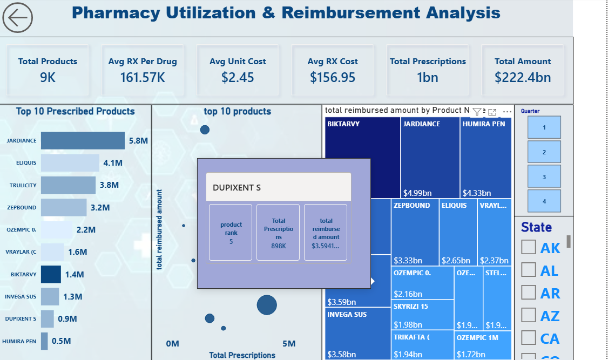

# pharmacy-reimbursement-for-sdud-
# US Medicaid Reimbursement Analytics 📊

Welcome to the **Medicaid Reimbursement Analytics** project! This repository contains an end-to-end data analytics solution built with **Power BI** to analyze the United States Medicaid State Drug Utilization Data. 

## 🎥 Dashboard Video Walkthrough
*Get a quick tour of the interactive features, page navigation, and state-level analysis.*

<video src="https://github.com/drmahelmahallawy-pixel/pharmacy-reimbursement-for-sdud-/raw/main/dashboard.mov" controls="controls" style="max-width: 100%;">
</video>

*(Note: If the video does not play automatically, please download the `dashboard.mov` file attached in this repository to watch it in full resolution).*

---

## 📸 Dashboard Previews

### 1. Summary Dashboard
Get a high-level overview of the total reimbursement and utilization across different metrics with a clean, app-like navigation interface.

### 2. States Analysis
A detailed geographic analysis using a Filled Map with a diverging color scale to accurately represent data skewness (highlighting massive variations between states like CA/NY and the rest).

### 3. Revenue Metrics
Deep dive into the financial aspects, total costs, and unit costs analysis.

### 4. Product Utilization Trends
Actionable insights into the volume of prescriptions vs. reimbursement amounts for the top drugs and products.

---

## 🎯 Business Objectives
- **Reimbursement Variations:** Analyze how reimbursement amounts differ across various states.
- **Top Products:** Identify the highest-cost drugs contributing to the total reimbursed amount.
- **Cost vs. Volume:** Explore the relationship between utilization volume and total cost.
- **User Experience:** Provide a highly interactive UI with seamless page navigation for stakeholders to explore complex KPIs effortlessly.

## 🛠️ Tools & Technologies
- **Power BI:** Data Modeling, DAX, Power Query, Data Visualization, UI/UX Navigation Buttons.
- **SQL / PostgreSQL:** Initial data extraction, cleaning, and exploration.
- **Data Source:** United States Medicaid State Drug Utilization Data.

## 💡 Key Features & Learnings
- **Handling Skewed Data:** Successfully managed heavily skewed geographical data by applying custom diverging color scales.
- **Advanced Navigation:** Built an intuitive app-like experience within Power BI using Page Navigation buttons and interactive cards.
- **Cost Analysis:** Created actionable scatter plots and metrics comparing Reimbursement vs. Prescriptions and Average Unit Cost.

## 📂 How to Use This Repository
1. Clone the repository or download the ZIP file.
2. Because the Power BI file is large, it is tracked using **Git LFS**. Make sure you have Git LFS installed to download the complete `pharmacy.pbix` file.
3. Open the `pharmacy.pbix` file using Power BI Desktop to interact with the dashboard, explore the DAX measures, and view the data model.
